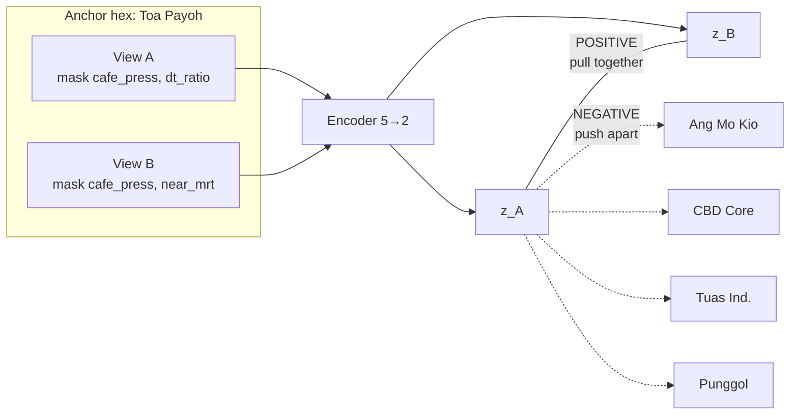

# Contrastive Training — Toy Demo (5 Hexes × 5 Features)

**Purpose:** Walk through contrastive (SCARF-style) embedding training on a tiny
Singapore-flavoured atlas. Use this to demo how Plexis-E hex8 signatures learn
*geometry* (functional similarity), not feature compression.

**Companion:** `EMBEDDING_V5_DESIGN.md` (full Plexis-E v1 design)

---

## What contrastive training does (one sentence)

> Teach the encoder that **two masked views of the same hex should map to the same
> point**, and **every other hex should map somewhere else** — so distance in
> embedding space ≈ functional similarity.

---

## The toy atlas

Five hex8 cells, five features. Realistic-ish values, exaggerated contrasts so
the geometry is easy to see.

| Hex | pop_res | comm_int | near_mrt | cafe_press | dt_ratio | Character |
|---|---|---|---|---|---|---|
| **Toa Payoh** | 8,000 | 0.55 | 1 | 12 | 0.90 | Mature HDB town centre |
| **Ang Mo Kio** | 7,500 | 0.52 | 1 | 11 | 0.85 | Mature HDB town centre (twin) |
| **CBD Core** | 2,000 | 0.95 | 1 | 45 | 2.50 | Office lunch magnet |
| **Tuas Ind.** | 500 | 0.15 | 0 | 2 | 0.60 | Industrial fringe |
| **Punggol** | 9,000 | 0.45 | 1 | 8 | 1.10 | Newer town |

**Feature key:**

| Column | Meaning |
|---|---|
| `pop_res` | Resident population |
| `comm_int` | Commercial intensity index |
| `near_mrt` | 1 if within 400 m of MRT, else 0 |
| `cafe_press` | Café competitive pressure (400 m) |
| `dt_ratio` | Daytime pop / resident pop (office influx) |

**Setup:**

- Encoder: 5 features → **2-d embedding** (2d so we can draw the map)
- Features z-scored before encoding (same idea as Plexis v10 normalisation)
- Loss: **InfoNCE** (contrastive) with temperature τ = 0.15
- Augmentation: **SCARF-style random masking** (~40% of columns zeroed per view)

---

## The training loop (conceptual)

```
for each training step:
    1. Pick anchor hex (e.g. Toa Payoh)
    2. Build view A — mask random 40% of features
    3. Build view B — mask a different random 40%
       → view A and view B are a POSITIVE pair (same hex, incomplete info)
    4. All other hexes in the batch are NEGATIVES
    5. Encode all views → unit vectors z
    6. Compute InfoNCE loss:
         pull z_A close to z_B
         push z_A away from every negative
    7. Update encoder weights
```



---

## Step 0 — Random encoder (untrained)

Weights are random. Geometry is meaningless — town centres may look like industrial
hexes by accident.

**Embeddings:**

| Hex | z (dim0, dim1) |
|---|---|
| Toa Payoh | [-0.612, -0.791] |
| Ang Mo Kio | [-0.734, -0.680] |
| CBD Core | [+0.493, -0.870] |
| Tuas Ind. | [+0.520, +0.854] |
| Punggol | [-0.476, -0.880] |

**Cosine similarity matrix** (1 = identical, -1 = opposite):

```
                 Toa Payoh  Ang Mo Kio  CBD Core  Tuas Ind.  Punggol
Toa Payoh           1.000      0.986     0.387     -0.994     0.987
Ang Mo Kio          0.986      1.000     0.230     -0.962     0.947
CBD Core            0.387      0.230     1.000     -0.487     0.531
Tuas Ind.          -0.994     -0.962    -0.487      1.000    -0.999
Punggol             0.987      0.947     0.531     -0.999     1.000
```

**Problem:** Toa Payoh ↔ Tuas similarity is **-0.994** — anti-correlated by random
chance, not because the model understands land use. No functional clusters yet.

---

## Step 1 — One contrastive step (anchor = Toa Payoh)

### Masked views (positives)

Z-scored features for Toa Payoh:

| Feature | Original | View A | View B |
|---|---|---|---|
| pop_res | +0.752 | ✓ kept | ✓ kept |
| comm_int | +0.102 | ✓ kept | ✓ kept |
| near_mrt | +0.500 | ✓ kept | **masked** |
| cafe_press | -0.238 | **masked** | **masked** |
| dt_ratio | -0.430 | **masked** | ✓ kept |

- **View A** masked: `cafe_press`, `dt_ratio`
- **View B** masked: `cafe_press`, `near_mrt`
- Both views = **same hex** → **positive pair**
- Ang Mo Kio, CBD, Tuas, Punggol → **negatives**

### Similarities before the gradient update

| Pair | Cosine sim | Target |
|---|---|---|
| TPY view A ↔ TPY view B (positive) | **+0.327** | HIGH |
| TPY view A ↔ Ang Mo Kio | +0.936 | LOW |
| TPY view A ↔ CBD Core | +0.558 | LOW |
| TPY view A ↔ Tuas Ind. | -0.997 | LOW |
| TPY view A ↔ Punggol | +1.000 | LOW |

**InfoNCE loss = 7.164** — high; the model treats Punggol as a better match for
Toa Payoh than Toa Payoh's own masked twin.

### After one gradient step

| Metric | Before | After |
|---|---|---|
| InfoNCE loss | 7.164 | **1.210** |
| Positive sim (TPY A ↔ TPY B) | +0.327 | **+0.975** |
| Mean negative sim | +0.374 | **+0.043** |

**What happened:** weights nudged so the two masked views of the same hex agree,
and all other hexes got pushed away.

---

## Step 2 — Full mini training (200 steps)

Every hex takes turns as anchor. Each step: new random masks, InfoNCE, weight update.

**Loss trajectory:** 0.061 → 2.182 (final steps oscillate as harder anchors rotate in;
average of last 20 steps ≈ 1.01).

### Final 2-d embeddings

| Hex | z (dim0, dim1) |
|---|---|
| Toa Payoh | [+0.300, +0.954] |
| Ang Mo Kio | [+0.250, +0.968] |
| CBD Core | [+0.934, -0.357] |
| Tuas Ind. | [-0.816, -0.578] |
| Punggol | [-0.009, +1.000] |

### ASCII map

```
                         dim1 (high)
                            ↑
              Punggol ●     |     ● Toa Payoh
                            |       ● Ang Mo Kio
                            |
         ───────────────────┼────────────────────→ dim0
                            |
              Tuas ●        |     ● CBD Core
```

- **Top-right cluster:** mature + newer towns (high residential character)
- **Bottom-right:** CBD (high commercial + daytime ratio)
- **Bottom-left:** Tuas industrial (isolated)

### Final cosine similarity matrix

```
                 Toa Payoh  Ang Mo Kio  CBD Core  Tuas Ind.  Punggol
Toa Payoh           1.000      0.999    -0.060     -0.797     0.951
Ang Mo Kio          0.999      1.000    -0.112     -0.764     0.966
CBD Core           -0.060     -0.112     1.000     -0.556    -0.365
Tuas Ind.          -0.797     -0.764    -0.556      1.000    -0.571
Punggol             0.951      0.966    -0.365     -0.571     1.000
```

### Sanity checks (what we want)

| Pair | Similarity | Verdict |
|---|---|---|
| TPY ↔ AMK (town centre twins) | **0.999** | ✓ Clustered |
| TPY ↔ Tuas (heartland vs industrial) | **-0.797** | ✓ Separated |
| CBD ↔ Tuas (commercial vs industrial) | **-0.556** | ✓ Separated |
| AMK ↔ Punggol (both residential towns) | **0.966** | ✓ Clustered |
| CBD ↔ TPY (office vs heartland) | **-0.060** | ✓ Separated |

No hand labels ("town centre", "industrial") were used. The model learned functional
clusters from **same-hex positive pairs + cross-hex negatives**.

### Learned feature weights (encoder 5 → 2)

| Feature | dim0 weight | dim1 weight | Reads as |
|---|---|---|---|
| near_mrt | +14.5 | +11.7 | Transit access — strong everywhere |
| comm_int | +9.0 | +4.7 | Commercial character — pulls CBD to dim0 |
| pop_res | -2.5 | **+7.0** | Residential mass — towns sit high on dim1 |
| dt_ratio | +1.3 | **-6.1** | Daytime/office influx — CBD signature |
| cafe_press | +4.1 | -4.3 | Fine-tunes F&B commercial mix |

**dim0** ≈ office/commercial axis (CBD high, towns low)  
**dim1** ≈ residential town axis (TPY, AMK, Punggol high; CBD low)

---

## The InfoNCE loss (plain English)

For anchor embedding **zₐ** (Toa Payoh view A), positive **zₚ** (Toa Payoh view B),
and negatives **zₙ** (all other hexes):

```
              exp(sim(zₐ, zₚ) / τ)
Loss = -log ─────────────────────────────────────────
              exp(sim(zₐ, zₚ) / τ) + Σ exp(sim(zₐ, zₙ) / τ)
```

- **Numerator:** how well the model recognises its own hex under masking
- **Denominator:** how confused it is with every other hex in the batch
- **τ (temperature):** sharpness of the decision (lower = harder margins)

Training minimises this loss → numerator grows, denominator's negative terms shrink.

---

## Toy → Plexis hex8 (scale-up)

| This demo | Plexis-E production |
|---|---|
| 5 hexes | 1,191 hex8 cells |
| 5 features | ~200 curated features (from 703) |
| 2-d embedding | 96–128-d signature |
| Linear encoder 5→2 | MLP 200→128→96 |
| Random mask any column | Mask per **view group** (WHO, WHERE, WHAT, FLOW, PRICE) |
| 200 steps | Thousands of steps, many masks per hex |
| 4 negatives per step | ~63 negatives per batch (batch size 64) |
| No reconstruction loss | + masked reconstruction (λ₁) in E1 |
| No cross-view heads | + demand→supply heads (λ₂) in E2 |

**Production query example:**

```python
# After training: find hexes functionally similar to Toa Payoh
anchor = signature["886526a305fffff"]   # Toa Payoh hex8_id
neighbours = top_k_cosine(signature_matrix, anchor, k=10)
# → expect AMK, Bedok, Clementi-type hexes, not Tuas or CBD
```

---

## Reproduce this demo

Runnable script (prints all tables above):

```bash
cd plexis-sgp-v5
python3 scripts/contrastive_toy_demo.py
```

Or inline:

```bash
python3 scripts/contrastive_toy_demo.py 2>/dev/null | less
```

---

## Demo talking points

1. **Start with Step 0** — show that random weights give nonsense geometry.
2. **Step 1 single update** — show masking creates positives; loss drops 7.16 → 1.21
   in one step. This is the "aha" moment.
3. **Step 2 final matrix** — TPY↔AMK at 0.999, TPY↔Tuas at -0.797. No labels used.
4. **Weight table** — encoder discovered office axis (dt_ratio) vs residential axis
   (pop_res) without being told.
5. **Scale-up slide** — same loop on 1,191 hex8 × 200 features = Plexis-E signature.

---

## Key failure modes to mention (production)

| Failure | Symptom | Guard |
|---|---|---|
| Collapse | All hexes cosine ≈ 0.99 | Non-degeneracy check on pairwise distances |
| Overfit | Great twins, bad held-out probes | Smaller MLP; beat PCA-256 on eval harness |
| Easy negatives | Loss → 0 fast, useless space | Hard negatives (same PA, different archetype) |
| Geography shortcut | Embedding ≈ lat/lng | Drop coordinates; subzone-held-out probes |

---

*Generated 2026-06-11. Numbers from deterministic run (seed=42 weights, seed=7
masking for Step 1, 200 training steps).*